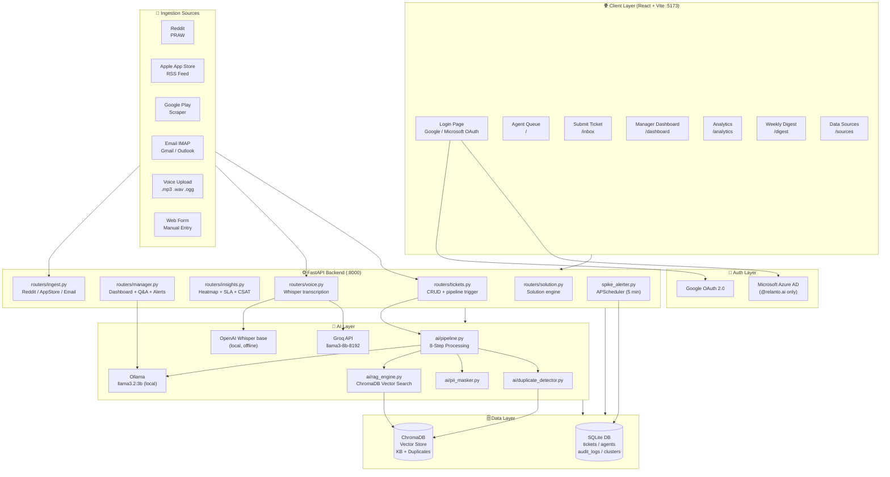
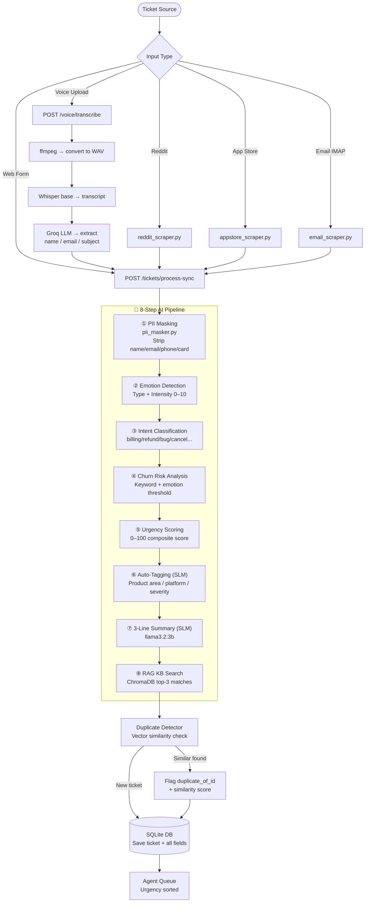
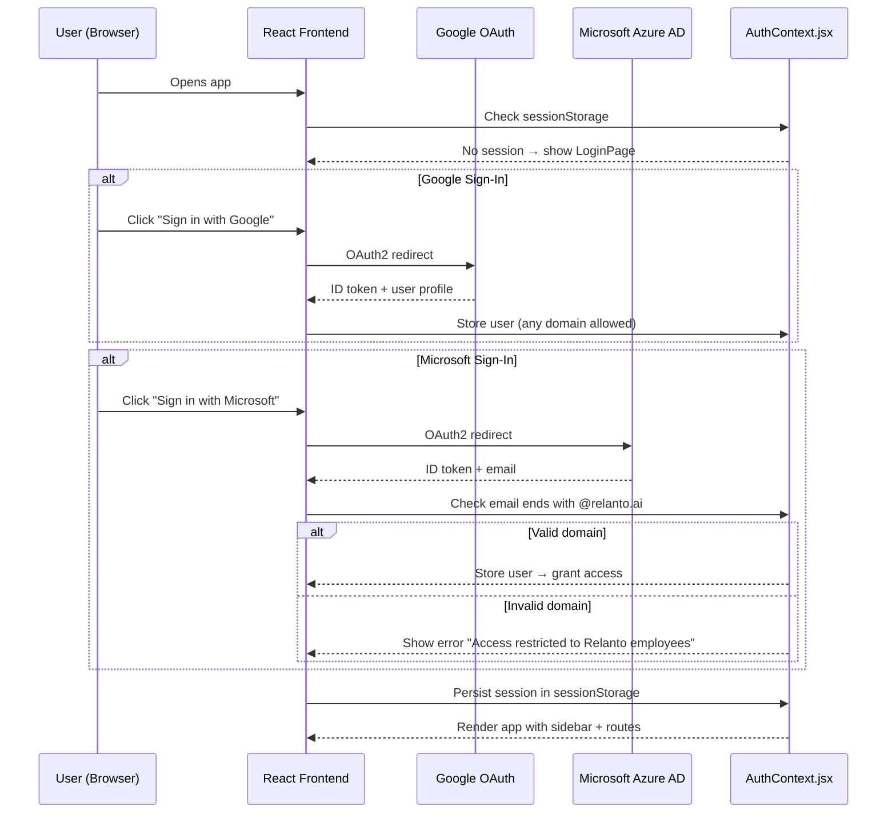
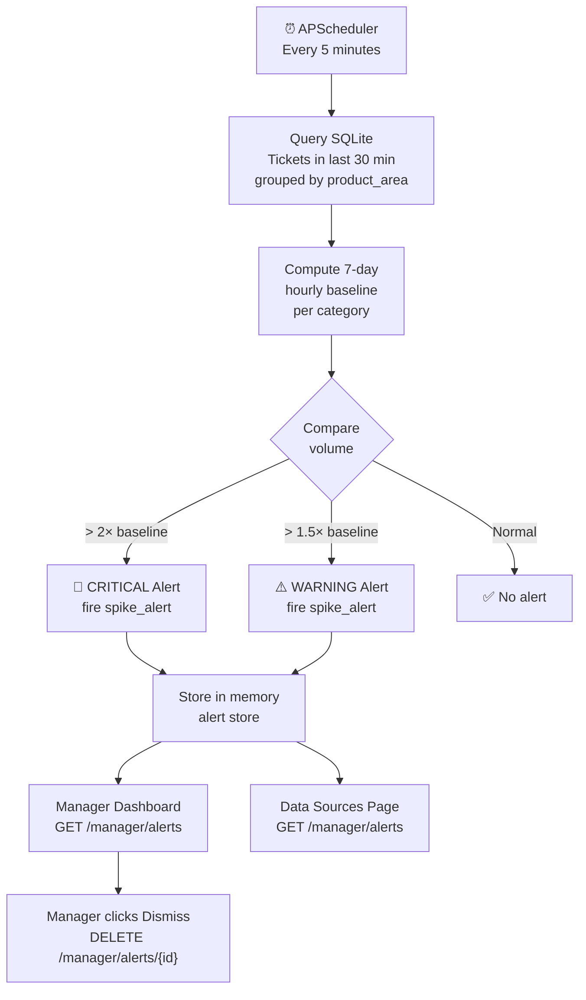
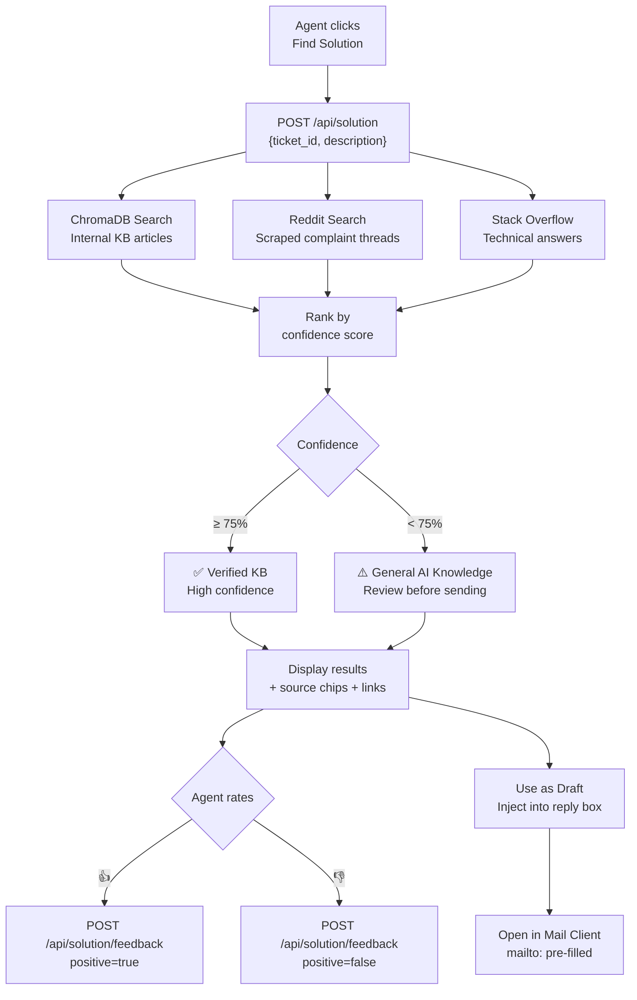
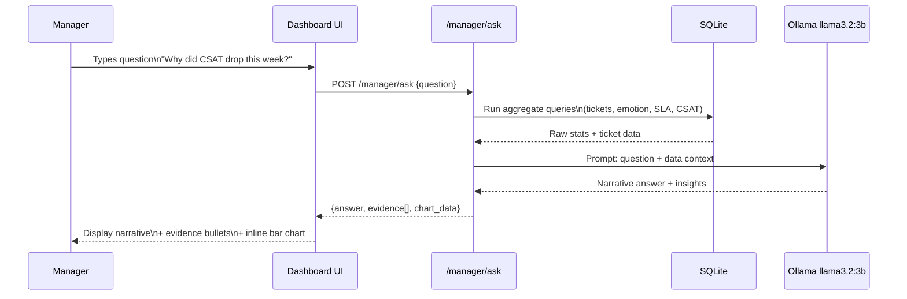
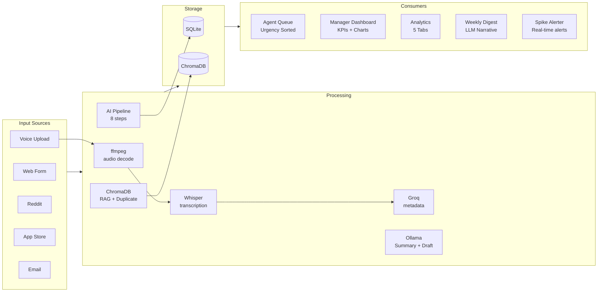

# 🏗️ SupportLens — High Level Design

---

## 1. System Architecture Overview

---

## 2. Ticket Ingestion & AI Pipeline Flow

---

## 3. Authentication Flow

---

## 4. Voice Transcription Flow

```mermaid
flowchart LR
    A["🎤 Audio Upload\n.mp3 / .wav / .ogg\n.m4a / .webm / .flac"] --> B["Save temp file\ntempfile.NamedTemporaryFile"]
    B --> C["ffmpeg subprocess\nConvert → 16kHz mono WAV\n(auto-detected from WinGet)"]
    C --> D["numpy array\nfloat32 PCM"]
    D --> E["Whisper base model\nmodel.transcribe(audio)"]
    E --> F["Raw transcript\nfull customer speech text"]
    F --> G["Groq llama3-8b-8192\nExtract structured fields"]
    G --> H["name\nemail\nsubject (5-7 words)"]
    H --> I["Auto-fill form\nsource = 'voice'"]
    I --> J["AI Pipeline\n8 steps"]
    J --> K["Ticket saved\nappears in Voice filter"]
```

---

## 5. Spike Alerter Flow

---

## 6. Solution Engine Flow

---

## 7. Manager Q&A Bot Flow

---

## 8. Data Flow Summary

---

## 9. Component Responsibility Map

| Component | Responsibility |
|-----------|---------------|
| `main.py` | FastAPI app, startup (RAG index, APScheduler), CORS |
| `database.py` | SQLAlchemy models, session factory, SQLite connection |
| `models.py` | Pydantic request/response schemas |
| `spike_alerter.py` | APScheduler job, spike detection logic, alert store |
| `ai/pipeline.py` | Orchestrates all 8 pipeline steps |
| `ai/ollama_client.py` | LLM calls: summary, draft, digest, Q&A |
| `ai/rag_engine.py` | ChromaDB build + similarity search |
| `ai/pii_masker.py` | Regex PII detection and masking |
| `ai/duplicate_detector.py` | Vector similarity duplicate check |
| `routers/tickets.py` | Ticket CRUD, draft reply, KB suggestions |
| `routers/manager.py` | Dashboard data, Q&A bot, agent stats, alerts, digest |
| `routers/insights.py` | Heatmap, SLA breakdown, sentiment trend, CSAT forecast |
| `routers/voice.py` | Audio upload, ffmpeg conversion, Whisper, Groq extraction |
| `routers/ingest.py` | Reddit/AppStore/Email ingestion triggers + status |
| `routers/solution.py` | Solution search across KB/Reddit/SO + feedback |
| `scrapers/reddit_scraper.py` | PRAW Reddit fetcher |
| `scrapers/appstore_scraper.py` | Apple RSS + Google Play scraper |
| `scrapers/email_scraper.py` | IMAP email fetcher |
| `solution_engine.py` | Multi-source solution search + ranking |
| `ingest_docs.py` | Bulk KB article loader into ChromaDB |
| `inject_customer_360.py` | Customer history seeder for demo |

---

*SupportLens · Relanto Hackathon 2026*
